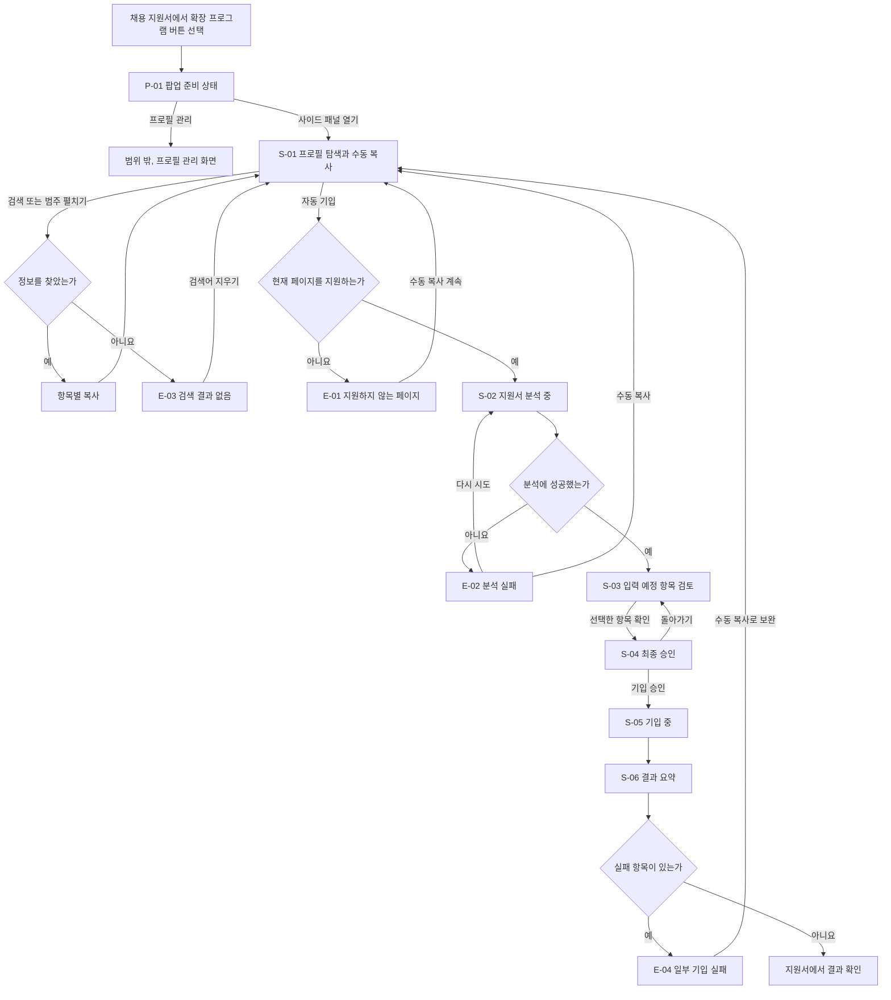
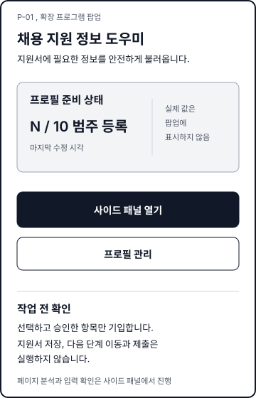
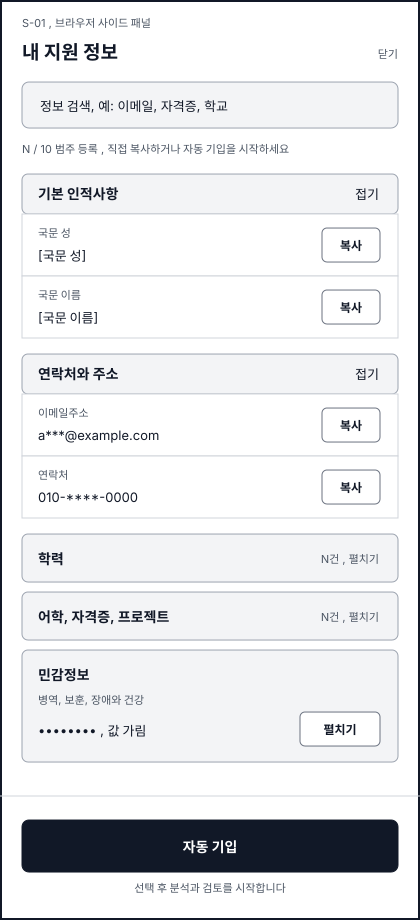
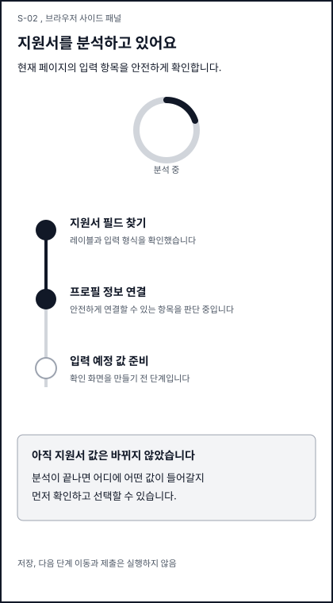
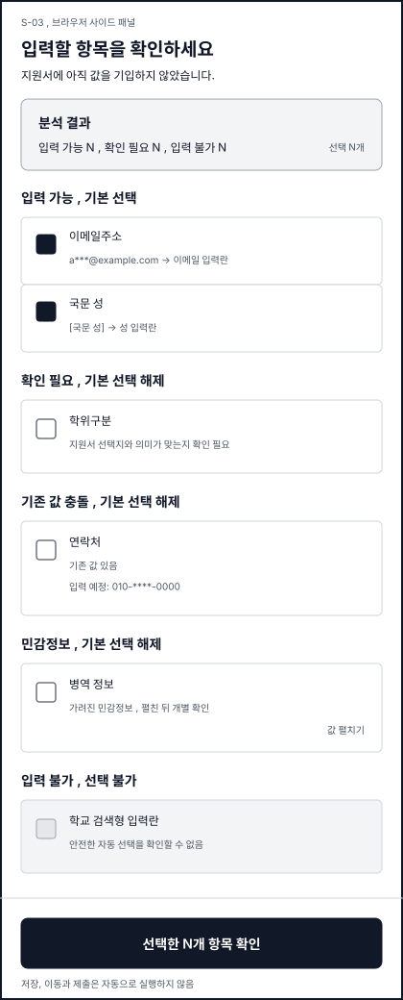
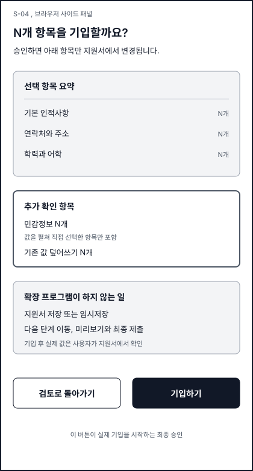
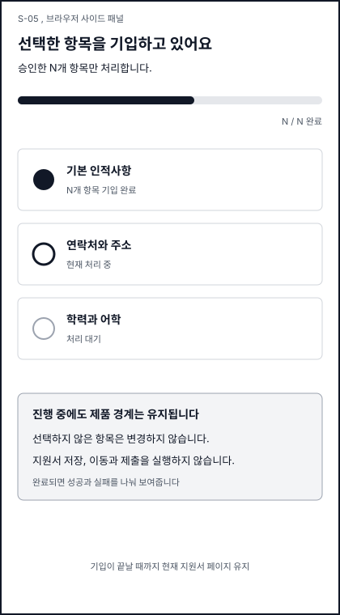
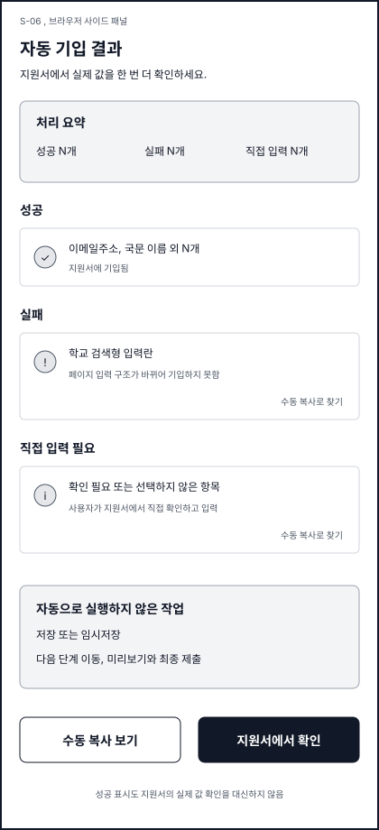
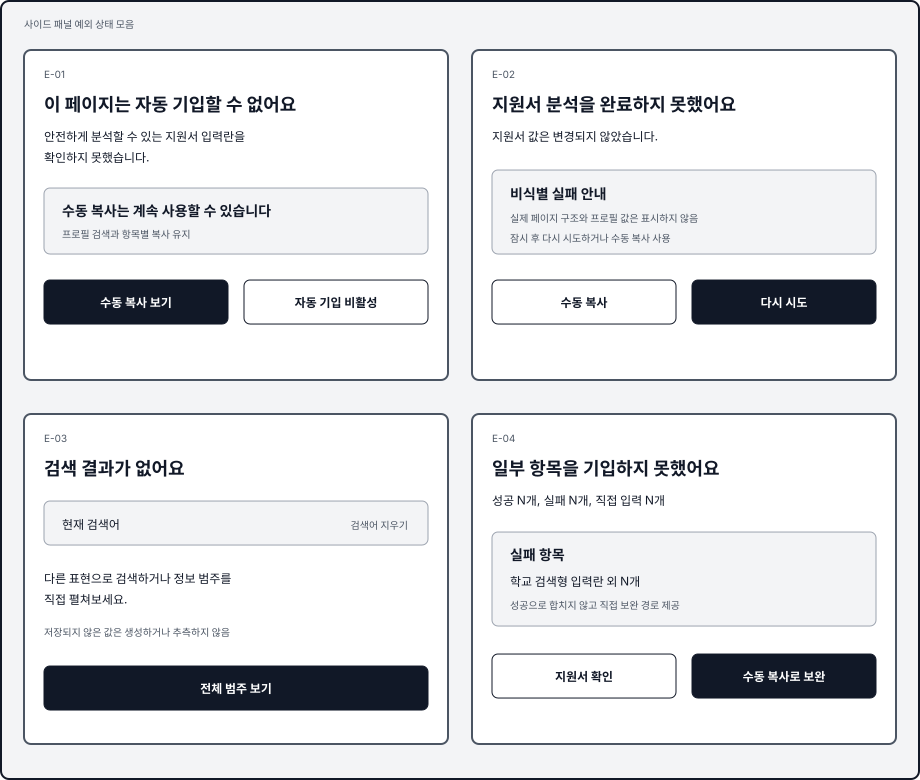

# 확장 프로그램 자동 기입 와이어프레임

## 문서 목적

이 문서는 채용 지원서 페이지에서 Chrome 확장 프로그램 버튼을 누른 뒤 수동 복사
또는 자동 기입을 거쳐 결과를 확인할 때까지의 화면 구조와 상태 전이를 정의한다.
후속 UI 디자인은 이 문서의 정보 구조와 제품 정책을 유지하면서 시각 언어를
결정한다.

기준 문서는 다음과 같다.

- `docs/PRODUCT_CONCEPT.md`
- `docs/PROFILE_FIELDS.md`
- `docs/adr/16-popup-side-panel-boundary.md`
- GitHub Issue #16

## 범위

### 포함

- 확장 프로그램 팝업의 준비 상태와 사이드 패널 진입
- 사이드 패널의 프로필 검색, 범주 탐색과 항목별 수동 복사
- 민감정보의 기본 가림과 개별 펼침
- `자동 기입`에서 시작하는 분석, 검토, 선택, 승인, 기입과 결과 요약
- 지원하지 않는 페이지, 분석 실패, 검색 결과 없음과 일부 기입 실패

### 제외

- 프로필 등록 및 관리 화면 자체
- 최종 UI의 색상, 타이포그래피, 아이콘, 간격 체계, 모션과 브랜드 표현
- 클릭 가능한 프로토타입과 프론트엔드 구현
- Chrome API, 저장 스키마, 페이지 분석과 기입 로직의 기술 설계
- 지원서 저장, 다음 단계 이동, 미리보기와 최종 제출 자동화

## 화면 책임

### 팝업

팝업은 사용자가 서비스를 알아보고 작업 공간으로 이동하는 진입점이다. 프로필이
얼마나 준비됐는지는 알려주지만 실제 프로필 값과 현재 페이지 분석 결과는 보여주지
않는다.

### 사이드 패널

사이드 패널은 지원서 페이지 옆에서 유지되는 작업 공간이다. 사용자는 저장된 값을
직접 복사하거나 `자동 기입`을 선택해 현재 지원서를 분석하고, 입력 예정 값을 확인한
뒤 승인할 수 있다.

## 제품 원칙

1. 사용자가 `자동 기입`을 선택하기 전에는 현재 페이지를 분석하지 않는다.
2. 분석과 실제 기입 사이에 입력 예정 필드와 값을 검토하는 단계를 둔다.
3. 승인되지 않은 항목과 기존 값은 변경하지 않는다.
4. 불확실한 항목, 충돌 항목과 민감정보는 기본 선택하지 않는다.
5. 지원하지 못한 항목과 실패를 숨기지 않고 결과 요약에 남긴다.
6. 확장 프로그램은 지원서를 저장하거나 다음 단계로 이동하거나 제출하지 않는다.
7. 와이어프레임의 값은 비식별 예시와 마스킹된 자리표시자로 표현한다.

## 상태와 기본 선택 정책

| 상태 | 의미 | 기본 선택 | 사용자가 할 수 있는 일 |
|---|---|---|---|
| 입력 가능 | 프로필 값과 지원서 필드의 연결이 명확하고 기존 값이 없음 | 선택 | 선택 해제, 예정 값 확인 |
| 확인 필요 | 연결 후보나 입력 형식에 사용자 판단이 필요함 | 선택 해제 | 근거와 예정 값을 보고 선택 |
| 기존 값 충돌 | 지원서의 기존 값과 프로필 값이 다름 | 선택 해제 | 기존 값과 예정 값을 비교한 뒤 덮어쓰기 선택 |
| 민감정보 | 병역, 보훈, 장애와 건강 정보처럼 건별 확인이 필요함 | 선택 해제 | 값을 펼치고 개별 선택 |
| 입력 불가 | 저장된 값이 없거나 안전한 변환을 할 수 없음 | 선택 불가 | 직접 입력 사유 확인 |

## 전체 사용자 흐름

## 화면 목록

| ID | 화면 | 핵심 목적 | 다음 상태 |
|---|---|---|---|
| P-01 | 팝업 준비 상태 | 서비스와 프로필 준비 상태를 확인하고 사이드 패널로 이동 | S-01 |
| S-01 | 프로필 탐색과 수동 복사 | 검색과 범주 탐색으로 값을 찾아 직접 복사 | S-01, S-02, E-03 |
| S-02 | 지원서 분석 중 | 현재 페이지 분석이 진행 중이며 아직 값을 바꾸지 않았음을 알림 | S-03, E-02 |
| S-03 | 입력 예정 항목 검토 | 상태별 예정 값과 기존 값 충돌을 검토하고 기입 대상을 선택 | S-04 |
| S-04 | 최종 승인 | 실제로 변경할 항목 수와 제출 금지 경계를 다시 확인 | S-03, S-05 |
| S-05 | 기입 중 | 승인된 항목의 처리 진행 상황을 표시 | S-06 |
| S-06 | 결과 요약 | 성공, 실패와 직접 입력 필요 항목을 구분 | 지원서 확인, E-04 |
| E-01 | 지원하지 않는 페이지 | 자동 기입 불가 사유를 알리고 수동 복사를 유지 | S-01 |
| E-02 | 분석 실패 | 페이지 값이 바뀌지 않았음을 알리고 재시도 또는 수동 복사 제공 | S-02, S-01 |
| E-03 | 검색 결과 없음 | 검색 조건을 바꾸거나 범주 탐색으로 돌아가도록 안내 | S-01 |
| E-04 | 일부 기입 실패 | 실패 필드와 직접 입력 방법을 결과 요약 안에서 제공 | S-01, 지원서 확인 |

## 화면 상세

### P-01 팝업 준비 상태

목적은 서비스 진입을 반복시키는 빈 중간 화면이 아니라, 작업 전 준비 상태와 안전
경계를 짧게 확인시키는 것이다.

- 표시 정보: 서비스 한 줄 설명, 등록된 프로필 범주 수, 마지막 수정 상태
- 기본 행동: `사이드 패널 열기`
- 보조 행동: `프로필 관리`
- 안전 안내: 선택한 항목만 기입하며 저장, 이동과 제출을 실행하지 않음
- 금지 정보: 실제 프로필 값, 현재 페이지 분석 결과와 입력 예정 값

### S-01 프로필 탐색과 수동 복사

사용자는 자동 기입을 시작하지 않고도 필요한 값을 찾아 지원서에 직접 붙여넣을 수
있다.

- 검색: 필드 표시명과 범주 이름으로 저장된 정보를 좁힘
- 범주: 기본 인적사항, 연락처와 주소, 학력, 어학, 자격증, 프로젝트, 병역, 보훈,
  장애와 건강
- 일반 항목: 마스킹된 예시 값과 `복사`
- 민감 항목: 기본 가림, `펼치기` 뒤 개별 복사
- 주요 행동: 화면 하단의 `자동 기입`
- 검색 결과가 없으면 E-03을 같은 작업 공간에 표시

### S-02 지원서 분석 중

- 표시 정보: 필드 탐지, 프로필 연결과 입력 예정 값 준비 단계
- 안전 안내: 분석 중에는 지원서 값을 변경하지 않음
- 성공하면 S-03, 실패하면 E-02로 이동

### S-03 입력 예정 항목 검토

- 상단 요약: 상태별 항목 수와 현재 선택 수
- 행 정보: 지원서 필드, 입력 예정 값, 필요한 경우 기존 값과 판단 근거
- 일반 입력 가능만 기본 선택
- 확인 필요, 기존 값 충돌과 민감정보는 기본 선택 해제
- 입력 불가는 비활성화하고 사유를 표시
- 주요 행동: `선택한 항목 확인`

### S-04 최종 승인

- 실제로 변경할 항목 수와 범주를 요약
- 민감정보와 기존 값 덮어쓰기 선택이 있으면 별도로 다시 표시
- 저장, 이동과 제출은 하지 않는다는 경계를 반복
- `검토로 돌아가기`와 `기입하기`를 제공

### S-05 기입 중

- 승인된 항목만 처리 중임을 표시
- 완료, 처리 중과 대기 상태를 구분
- 지원서 저장, 이동과 제출은 실행하지 않음을 유지
- 처리 완료 뒤 성공 여부와 관계없이 S-06으로 이동

### S-06 결과 요약

- 성공: 지원서에 기입된 항목
- 실패: 시도했지만 기입되지 않은 항목과 비식별 사유
- 직접 입력 필요: 입력 불가 또는 사용자가 선택하지 않은 항목
- 사용자가 지원서의 실제 값을 직접 확인하도록 안내
- 일부 실패가 있으면 E-04의 보완 행동을 함께 표시

## 예외 상태

### E-01 지원하지 않는 페이지

자동 기입 버튼은 사용할 수 없지만 프로필 검색과 수동 복사는 유지한다. 지원하지
않는 이유를 숨기거나 범용 매처로 성공처럼 표시하지 않는다.

### E-02 분석 실패

지원서 값이 변경되지 않았음을 먼저 알린다. `다시 시도`와 `수동 복사`를 제공하며
실제 페이지 구조나 개인정보를 오류 문구에 포함하지 않는다.

### E-03 검색 결과 없음

검색어를 지우거나 다른 범주를 펼칠 수 있게 한다. 프로필에 없는 정보를 자동으로
생성하거나 추측하지 않는다.

### E-04 일부 기입 실패

성공 항목과 실패 항목을 함께 보여주되 실패를 전체 성공으로 합치지 않는다. 실패
항목은 수동 복사 화면에서 해당 프로필 정보를 다시 찾을 수 있게 연결한다.

## 비식별 예시 규칙

- 실제 사람 이름 대신 `[국문 성]`, `[국문 이름]`처럼 필드 의미를 사용한다.
- 이메일과 연락처는 `a***@example.com`, `010-****-0000`처럼 마스킹한다.
- 민감정보는 값 대신 `가려진 민감정보`를 사용한다.
- 기존 값 충돌은 실제 문자열 대신 `기존 값 있음`과 `입력 예정 값`으로 비교한다.
- 항목 수는 `N개`처럼 구조를 설명하는 자리표시자를 사용한다.

## UI 디자인 인계 기준

후속 UI 디자인은 다음을 결정할 수 있다.

- 최종 색상, 타이포그래피, 아이콘과 간격 체계
- 팝업과 사이드 패널의 정확한 너비 및 반응형 처리
- 상태 구분의 시각 언어와 접근성 표현
- 목록 밀도, 펼침 방식과 진행 상태의 모션

다음 제품 계약은 변경하지 않는다.

- 팝업과 사이드 패널의 책임 경계
- 수동 복사와 자동 기입 두 경로
- 분석, 검토, 최종 승인과 실제 기입의 분리
- 상태별 기본 선택 정책
- 결과 요약과 제출 금지 원칙
