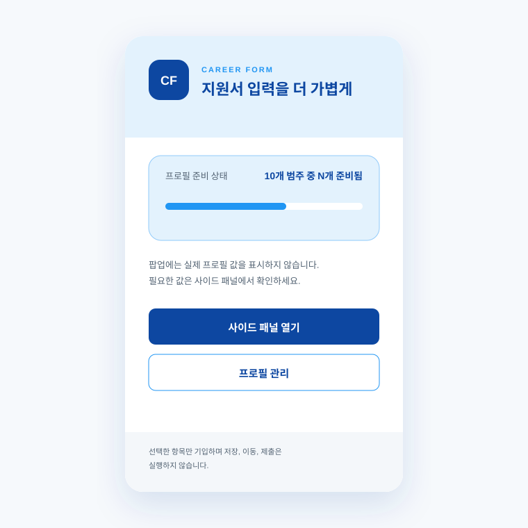
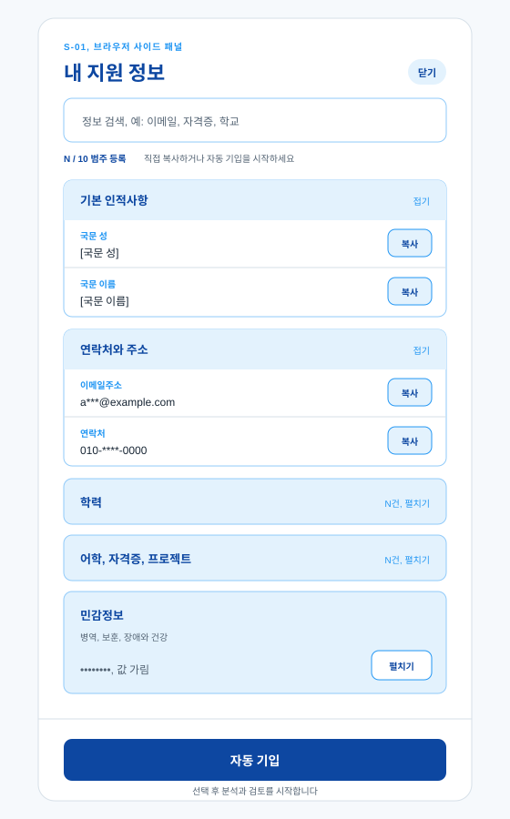
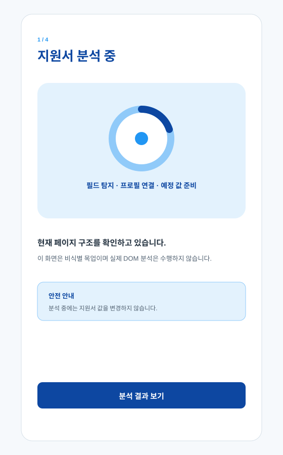
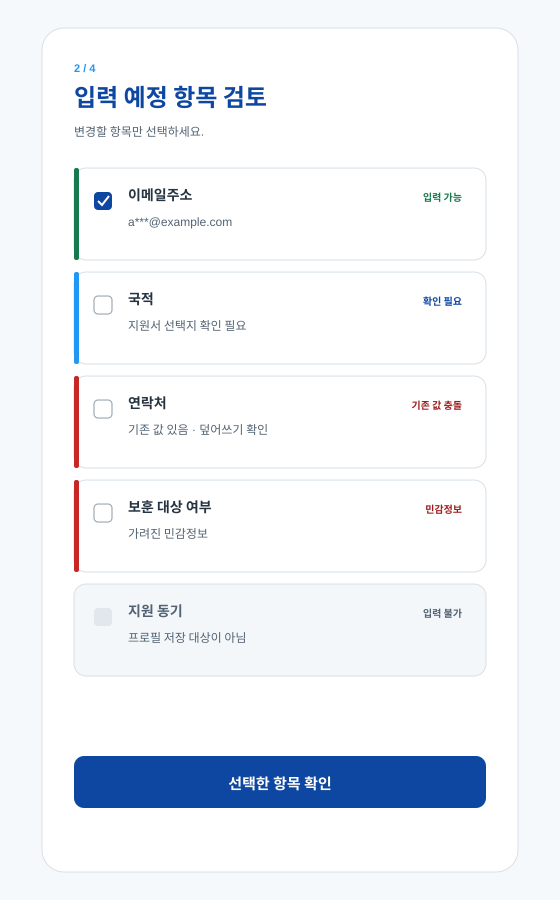
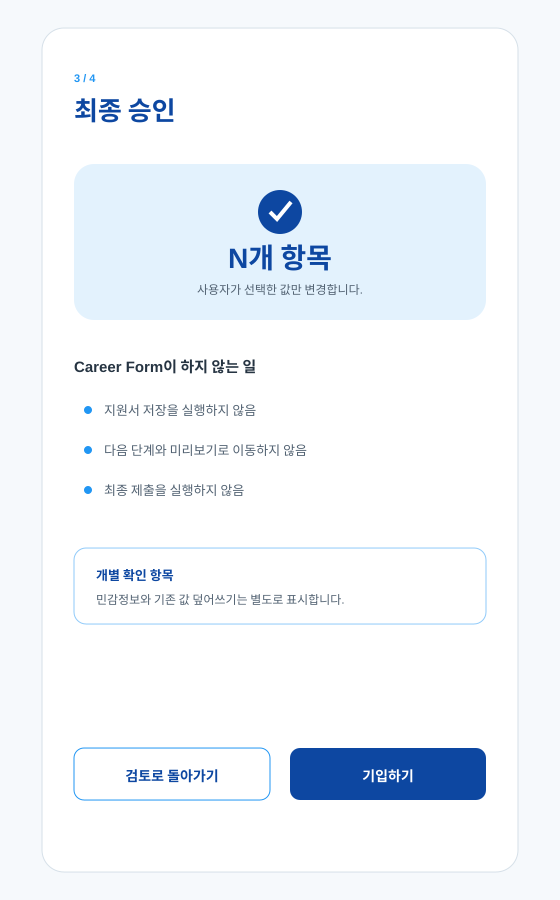
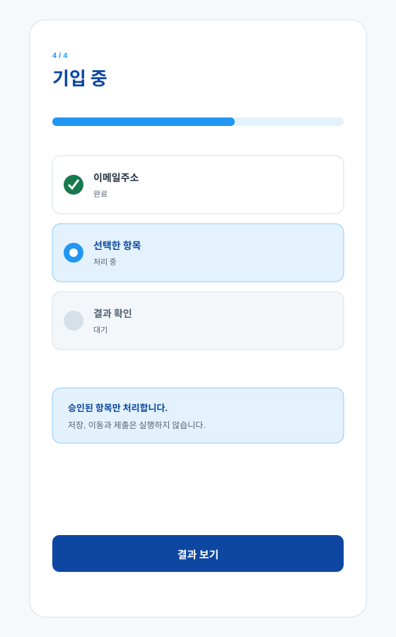
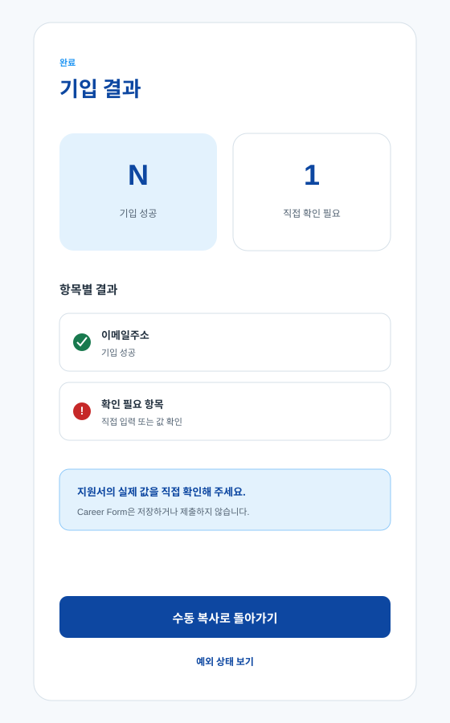
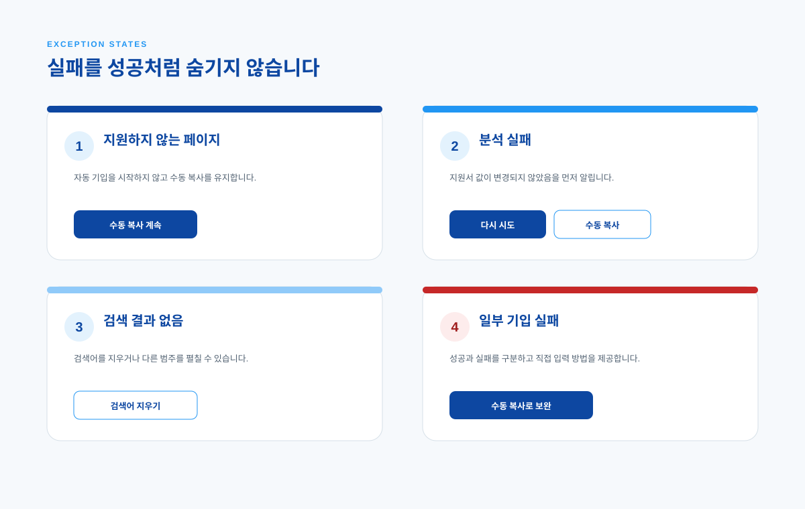
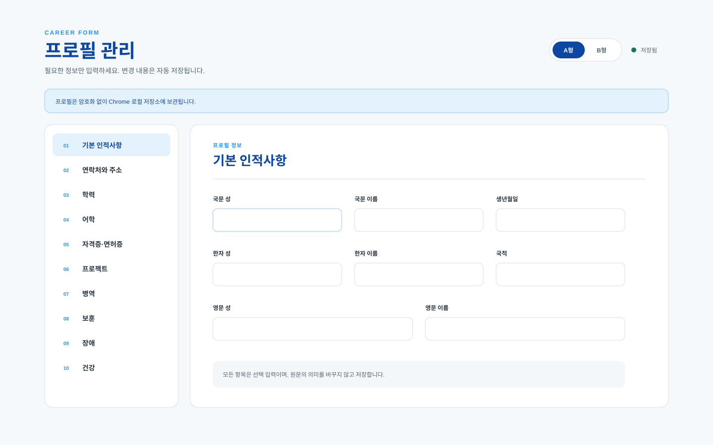
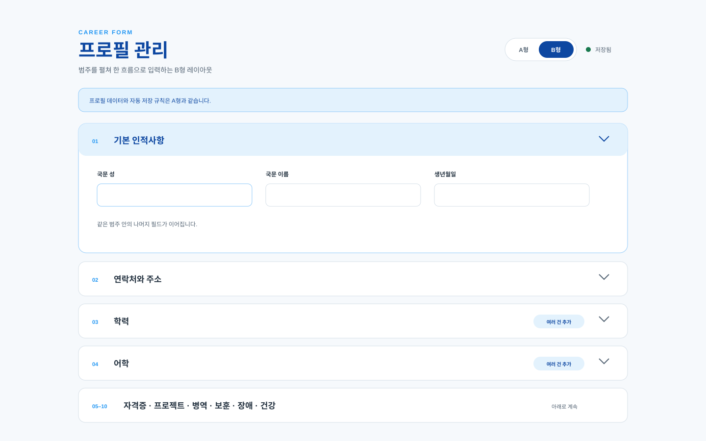

# 확장 프로그램 프로필 UI 컬러 디자인

## 목적

Issue #16의 화면 책임과 흐름을 실제 프론트엔드 구조에 적용하고, 프로필 관리 A형·B형을 더해 하나의 컬러 디자인 언어로 정의한다. 이 문서는 시각 정본이고 동작과 저장 계약은 Issue #35 및 `docs/adr/35-local-profile-storage.md`를 따른다.

## 디자인 방향

- **차분한 작업 도구:** 넓은 흰색 작업면과 얕은 그림자로 긴 입력 과정의 피로를 줄인다.
- **명확한 다음 행동:** 가장 중요한 행동에만 진한 파랑을 사용하고 보조 행동은 테두리 버튼으로 구분한다.
- **신뢰 가능한 상태:** 상태명, 설명과 아이콘 또는 테두리를 함께 사용해 색만으로 의미를 전달하지 않는다.
- **정보 노출 통제:** 팝업에는 준비 개수만 표시하고, 사이드 패널의 민감 값은 개별 펼침 전까지 가린다.

## 의미 기반 색상 토큰

| 의미 | 기본 팔레트 | 용도 |
|---|---:|---|
| `accent-soft` | `#E3F2FD` | 선택 배경, 안내, 진행 영역 |
| `accent` | `#90CAF9` | 구분선, 보조 강조 |
| `action` | `#2196F3` | 포커스, 진행, 링크와 보조 행동 |
| `action-strong` | `#0D47A1` | 주요 버튼, 제목과 강한 강조 |
| `surface` | `#FFFFFF` | 카드와 입력 표면 |
| `page` | `#F6F9FC` | 페이지 배경 |
| `text` | `#263442` | 본문 |
| `text-muted` | `#526272` | 보조 설명 |

구현에서는 원색을 컴포넌트에 직접 쓰지 않고 `frontend/src/styles/global.css`의 의미 토큰을 참조한다. 이후 팔레트를 교체해도 컴포넌트 구조와 상태 이름은 유지한다.

## 화면 시안

### 진입과 수동 복사

팝업은 실제 값을 숨기고 준비 범주 수와 두 진입 행동만 제공한다. 사이드 패널은 기본 인적사항, 연락처, 학력, 어학·자격증·프로젝트, 민감정보를 아코디언으로 모아 보여준다. 범주·필드명 검색은 이 그룹 구조를 유지하며, 일반 값 복사와 민감 값 개별 펼침을 제공한다.

### 자동 기입 검토 흐름

입력 가능만 기본 선택한다. 확인 필요, 기존 값 충돌과 민감정보는 해제하고 입력 불가는 비활성화한다. 실제 DOM 분석과 기입은 이번 구현에 없으며 모든 값은 비식별 목업이다.

### 프로필 관리 레이아웃

A형은 왼쪽 범주 메뉴와 오른쪽 집중 폼을 사용한다. B형은 같은 데이터와 폼을 범주별 accordion으로 길게 탐색한다. 기본은 A형이며 사용자의 선택은 프로필 데이터와 분리해 저장한다.

## 접근성과 반응형 원칙

- 본문과 버튼은 흰색 또는 밝은 배경에서 WCAG AA 수준의 대비를 목표로 한다.
- 모든 입력은 표시 label을 가지며 키보드 포커스에 `action` 색상의 외곽선을 표시한다.
- 상태는 색과 함께 상태명 및 이유를 표시한다.
- options A형은 좁은 화면에서 범주 메뉴가 위로 이동하고 2열 메뉴로 바뀐다.
- side panel 값은 한 줄 말줄임을 사용하되 복사 버튼의 접근 가능한 이름에 필드명을 포함한다.

## 개인정보 표현 규칙

SVG에는 `[국문 이름]`, `a***@example.com`, `010-****-0000`, `가려진 민감정보`, `기존 값 있음`만 사용한다. 실제 지원 정보, 계정 정보와 브라우저 세션 상태는 포함하지 않는다.
