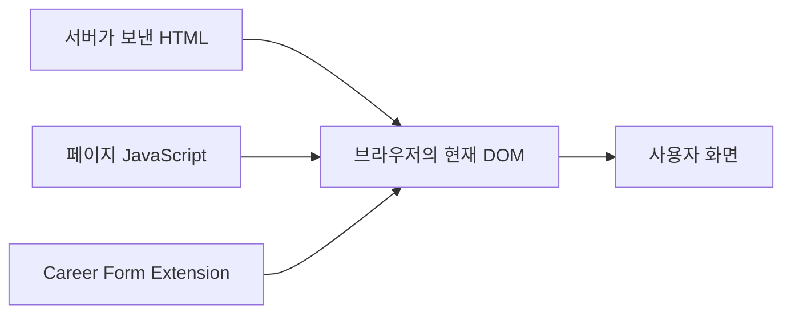
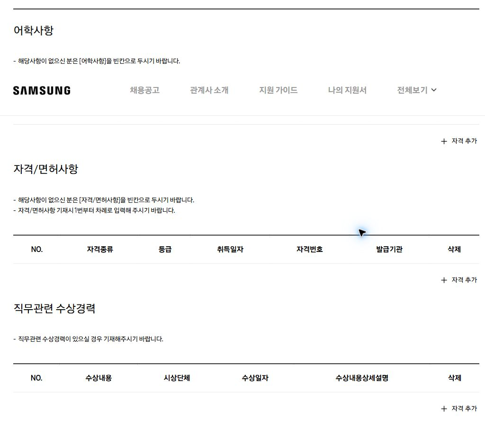
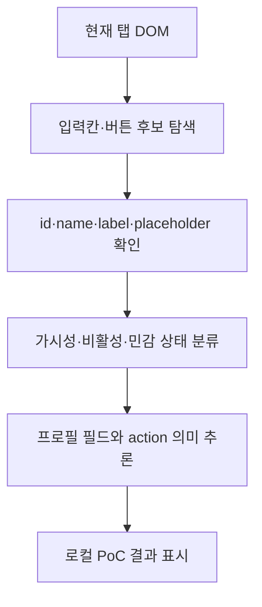
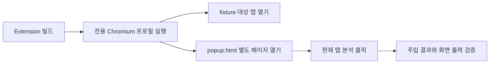
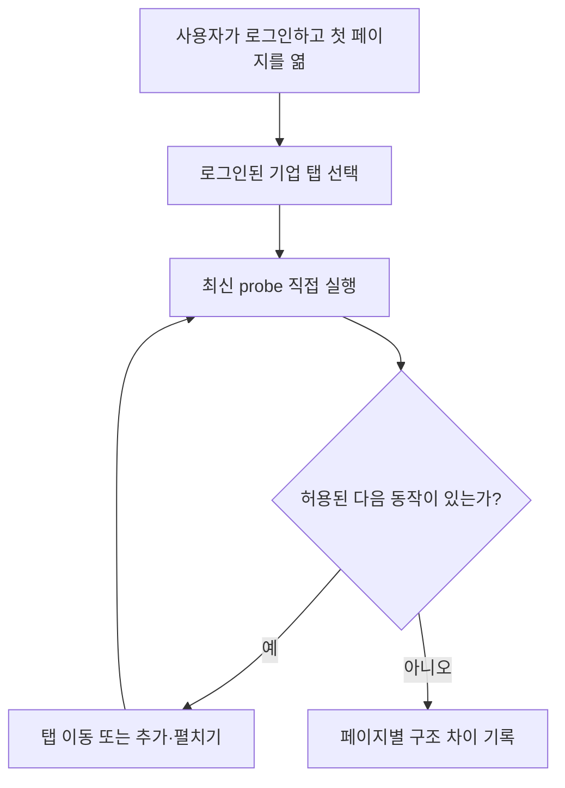

# HTML을 몰라도 이해하는 지원서 페이지 분석

## 문서 목적

Career Form은 사용자가 브라우저에서 열어 둔 채용 지원서의 입력칸을 찾아, 저장된 프로필 정보와 연결하려 한다. 이 문서는 HTML을 처음 접하는 사람도 다음 질문에 답할 수 있도록 작성했다.

- 화면에 보이지 않는 입력칸도 찾을 수 있는가?
- 각 입력칸이 무엇을 의미하는지 어떻게 판단하는가?
- 숨겨진 입력칸에도 값을 넣을 수 있는가?
- 분석 결과를 제품 데이터로 어떻게 보관해야 안전한가?

이 문서의 삼성 사례는 2026년 8월 13일 사용자가 직접 연 지원서 페이지에서 읽기 전용 Extension PoC로 확인했다. 실제 입력값, 전체 HTML, 세션 정보와 URL 경로는 기록하지 않았다.

## 1. 먼저 알아야 할 최소 개념

### HTML은 화면의 재료 목록이다

HTML은 웹페이지에 무엇이 있는지를 표현한다. 제목, 설명, 입력칸과 버튼 등이 HTML 요소다.

```html
<label for="license-name">자격증명</label>
<input id="license-name" name="certificateName" type="text">
<button id="add-license" type="button">자격 추가</button>
```

위 HTML에는 다음 정보가 있다.

| HTML | 사람이 이해하는 의미 |
| --- | --- |
| `<label>` | 입력칸의 이름은 `자격증명` |
| `<input type="text">` | 글자를 입력하는 칸 |
| `id="license-name"` | 페이지 안에서 요소를 구별하는 식별자 |
| `name="certificateName"` | 폼이 값을 전송할 때 사용하는 이름 |
| `<button>` | 사용자가 실행할 수 있는 동작 |

### DOM은 브라우저가 만든 현재 페이지 구조다

브라우저는 HTML을 읽어 JavaScript가 탐색할 수 있는 객체 구조를 만든다. 이것이 DOM(Document Object Model)이다.

HTML이 최초 설계도라면 DOM은 사용자가 탭을 열고 버튼을 누른 뒤의 현재 상태다. JavaScript로 새 입력칸을 추가하거나 기존 영역을 숨기면 DOM에 그 결과가 반영된다.



Career Form은 서버의 원본 HTML 파일을 다운로드해 분석하는 것이 아니라, 사용자가 현재 열어 둔 탭의 DOM을 읽는다. 그래서 JavaScript가 동적으로 만든 필드도 DOM에 생성된 뒤라면 찾을 수 있다.

### CSS는 요소를 보이거나 숨긴다

요소가 DOM에 존재한다고 항상 화면에 보이는 것은 아니다. 다음과 같은 CSS나 HTML 속성으로 숨길 수 있다.

```html
<section hidden>
  <input name="certificateName" type="text">
</section>
```

```css
.inactive-section {
  display: none;
}
```

이 경우 입력칸은 화면에 보이지 않지만 DOM에는 있으므로 Extension이 발견할 수 있다.

반대로 `자격 추가`를 눌러야 JavaScript가 입력칸을 새로 만드는 페이지라면, 버튼을 누르기 전 DOM에는 해당 입력칸 자체가 없다. 이 필드는 숨겨진 필드가 아니라 아직 생성되지 않은 필드다.

### 입력칸에는 여러 종류가 있다

| 종류 | 대표 HTML | 용도 |
| --- | --- | --- |
| 한 줄 텍스트 | `<input type="text">` | 이름, 자격번호, 회사명 |
| 여러 줄 텍스트 | `<textarea>` | 자기소개, 담당업무 |
| 선택 목록 | `<select>` | 국가, 학위구분 |
| 단일 선택 | `<input type="radio">` | 국내·해외 중 하나 선택 |
| 복수 선택 | `<input type="checkbox">` | 여러 동의 또는 조건 선택 |
| 숨은 시스템 값 | `<input type="hidden">` | 내부 ID, 상태, 토큰 |
| 커스텀 선택 UI | `role="combobox"` | 검색 가능한 선택 상자 |

`<input type="hidden">`은 다른 섹션에 잠시 숨겨진 일반 입력칸과 다르다. 사용자가 입력하는 UI가 아니라 페이지 내부 상태를 전송하기 위한 요소일 수 있으므로 자동 입력 대상으로 취급하면 안 된다.

## 2. 실제 삼성 지원서에서는 어떻게 보이는가

삼성 지원서는 기본인적사항, 학력사항, 경력사항, 외국어/자격사항과 Essay를 별도 섹션으로 제공한다. 아래는 실제 외국어/자격사항 화면에서 개인정보와 입력값이 없는 영역만 캡처한 것이다.



화면에서 한 섹션만 선택하더라도 다른 섹션의 일부 입력 요소가 DOM에서 제거되지 않고 숨겨진 채 남아 있었다. 따라서 화면에 보이는 요소만 세면 향후 입력할 필드를 놓칠 수 있고, DOM 전체만 세면 비활성 섹션의 요소와 선택 UI 내부 요소까지 중복 집계할 수 있다.

실제 페이지에서 확인한 일부 구조는 다음과 같다. 실제 입력값은 읽거나 기록하지 않았다.

| 화면 또는 구조상 의미 | DOM ID | DOM name | 요소 종류 | 당시 상태 |
| --- | --- | --- | --- | --- |
| 어학사항 행 추가 | `addFlptsBtn` | 없음 | button | 표시됨 |
| 자격/면허사항 행 추가 | `addEtcBtn` | 없음 | button | 표시됨 |
| 직무 관련 수상경력 행 추가 | `addPrizeBtn` | 없음 | button | 표시됨 |
| 외국어 자격 유형 | `test1`~`test3` | `testType` | radio | 숨김 |
| 외국어 자격명 선택 원본 | `ui-id-1` | 없음 | select | 숨김 |
| 한자 자격명 선택 원본 | `ui-id-2` | 없음 | select | 숨김 |
| 직무 관련 자격·면허 선택 원본 | `ui-id-3` | 없음 | select | 숨김 |
| 자격명 선택 화면 UI | `ui-id-*-button` | 없음 | combobox | 숨김 |
| 자격명 선택 옵션 목록 | `ui-id-*-menu` | 없음 | listbox | 숨김 |
| 다음 섹션인 Essay 이동 | `nextBtn` | 없음 | button | 표시됨 |

실제 DOM의 선택지까지 대조한 결과 `ui-id-1`에는 TOEIC·TEPS·TOEFL 등의 외국어 자격, `ui-id-2`에는 한자급수자격검정, `ui-id-3`에는 운전면허증 등의 직무 관련 자격·면허가 들어 있었다. 입력값은 읽지 않았고 선택지의 구조적 의미만 확인했다.

여기서 `ui-id-1`, `ui-id-1-button`, `ui-id-1-menu`는 서로 다른 입력값 세 개가 아니다. 하나의 선택 기능을 native `select`, 화면에 보이는 combobox와 옵션 listbox로 나눠 구현한 것이다. DOM 요소를 찾는 것과 사용자가 인식하는 논리적 필드를 찾는 것은 별도 문제다.

세 추가 버튼의 화면 문구는 모두 `+자격 추가`였지만 DOM ID와 주변 제목은 서로 달랐다. `addFlptsBtn`은 어학사항, `addEtcBtn`은 자격/면허사항, `addPrizeBtn`은 직무 관련 수상경력에 속했다. 버튼 문구만 보면 세 동작을 구분할 수 없고 ID와 가까운 섹션 문맥을 함께 봐야 한다. 현재 PoC가 세 버튼을 모두 `qualification.add`로 분류한 것은 오탐이다.

또한 `+자격 추가`를 한 번 실행했을 때 전체 DOM 후보는 21개에서 33개로 증가했고, 실제 표시 후보는 0개에서 7개로 증가했다. 즉 숨겨진 DOM을 모두 읽어도, 버튼 실행 전 아직 생성되지 않은 필드는 알 수 없다.

## 3. Extension은 무엇을 어떤 원리로 읽었는가

### 분석 순서

읽기 전용 PoC는 현재 탭에서 다음 순서로 동작한다.

1. DOM에서 `input`, `textarea`, `select`와 ARIA 입력 역할을 찾는다.
2. 각 요소의 `type`, `id`, `name`, `required`, `disabled`를 읽는다.
3. `label`, `aria-label`, `aria-labelledby`, placeholder와 주변 문맥에서 표시명을 찾는다.
4. 조상 요소의 `hidden`, `aria-hidden`, `display:none`, `visibility:hidden`을 검사한다.
5. label과 식별자를 Career Form의 프로필 필드 이름으로 정규화한다.
6. 버튼의 ID, name과 표시명을 읽어 `추가`, 이동, 저장과 제출 동작을 구분한다.
7. 입력값, 전체 HTML, selector와 URL은 결과에 포함하지 않는다.



### 실제 출력의 일부

아래 예시는 실제 삼성 외국어/자격사항 결과에서 계정 정보와 무관한 항목만 발췌한 것이다.

```json
{
  "fields": [
    {
      "element": "input",
      "domId": "test3",
      "domName": "testType",
      "displayName": "기타 외국어 자격",
      "profileField": "language",
      "control": "radio",
      "visibility": "hidden",
      "status": "supported",
      "confidence": "exact"
    },
    {
      "element": "select",
      "domId": "ui-id-3",
      "domName": "",
      "displayName": "",
      "profileField": "unknown",
      "control": "select",
      "visibility": "hidden",
      "status": "supported",
      "confidence": "unknown"
    }
  ],
  "actions": [
    {
      "element": "button",
      "domId": "addEtcBtn",
      "domName": "",
      "displayName": "+자격 추가",
      "action": "qualification.add",
      "visibility": "visible",
      "safeToInvoke": true
    }
  ]
}
```

`profileField`와 `action`은 DOM에 원래 존재하는 값이 아니다. PoC가 label, ID와 주변 문맥을 보고 Career Form의 프로필 필드와 동작으로 추론한 결과다. 예시의 `addEtcBtn`은 실제로 자격/면허사항 행 추가에 해당하지만, 같은 문구를 가진 다른 버튼에는 같은 추론을 적용하면 안 된다.

- `exact`: 레이블이나 명시적인 식별자로 의미가 분명함
- `heuristic`: 주변 문맥을 종합해 추론함
- `unknown`: 안전하게 의미를 확정할 수 없음

`domId`와 `domName`은 유용한 단서지만 그 자체가 정답은 아니다. 실제 결과에서도 `ui-id-1`, `test1`처럼 의미가 없는 ID가 있었고, 하나의 선택 UI가 여러 DOM 요소로 나타났다. label, 섹션, 옵션과 요소 사이의 관계를 함께 봐야 한다.

### PoC에서 확인된 한계

- 페이지 헤더와 로그인 UI도 함께 탐색되어 지원서 필드와 무관한 요소가 섞일 수 있다.
- 하나의 선택 UI가 `select`, `combobox`, `listbox`로 중복 탐지될 수 있다.
- 교차 출처 iframe 내부는 브라우저 보안 정책 때문에 읽을 수 없다.
- closed Shadow DOM 내부도 외부 코드에서 읽을 수 없다.
- 의미 추론 규칙이 부족하거나 단어가 우연히 겹치면 잘못 매핑할 수 있다.
- `추가` 버튼 실행 뒤에만 생성되는 필드는 실행 전에는 발견할 수 없다.

따라서 범용 분석기는 모호한 필드를 억지로 매핑하지 않고 `unknown` 또는 `review-required`로 남겨야 한다. 실제 기업별로 안정적인 매핑이 필요하면 검증된 회사 어댑터 규칙이 별도로 필요하다.

## 4. 결론과 권장 데이터 저장 방식

### 결론 1: 숨겨진 필드를 알 수 있는가

> 접근 가능한 DOM에 이미 존재한다면 체크박스, radio, select, 텍스트 입력과 커스텀 ARIA 입력을 화면 표시 여부와 관계없이 발견할 수 있다.

다만 아직 DOM에 생성되지 않은 필드, 교차 출처 iframe과 closed Shadow DOM 내부는 찾을 수 없다. `input type="hidden"`은 발견할 수 있지만 사용자 입력칸으로 간주하지 않는다.

### 결론 2: 무엇을 입력해야 하는지 알 수 있는가

> `domId`와 `domName`은 중요한 단서지만, 그것만으로 필드 의미를 항상 확정할 수는 없다.

label, placeholder, ARIA 이름, 상위 섹션, select 옵션, radio 그룹과 관련 버튼을 함께 분석해야 한다. 그래도 불명확하면 추측하지 않고 `unknown`으로 남겨야 한다.

### 결론 3: 숨겨진 필드에도 입력할 수 있는가

> CSS로만 숨겨진 일반 입력 요소에는 JavaScript로 값을 설정할 수 있지만, 페이지가 그 값을 정상 입력으로 인정한다고 보장할 수는 없다.

페이지 프레임워크가 관리하는 상태와 `input`·`change` 이벤트가 함께 갱신되어야 할 수 있다. `disabled` 필드는 입력·제출 대상이 아니며, `input type="hidden"`은 시스템 상태일 수 있어 자동 입력하면 안 된다.

따라서 권장 방식은 다음과 같다.

1. 안전한 탭 전환이나 `추가` 동작으로 필드를 정상 표시한다.
2. 표시된 일반 입력 요소에 값을 적용한다.
3. 페이지가 요구하는 입력 이벤트를 발생시킨다.
4. 값이 화면과 페이지 상태에 반영됐는지 확인한다.
5. 저장·다음 이동·제출은 사용자 승인을 받은 별도 동작으로 둔다.

### 무엇을 저장할 것인가

실제 지원서 입력값이나 전체 HTML을 저장하지 않고, 검증된 구조 규칙만 저장하는 방식을 권장한다.

```json
{
  "company": "samsung",
  "page": "application",
  "section": "qualification",
  "logicalField": "qualification.name",
  "control": "combobox",
  "locatorHints": {
    "ids": ["ui-id-1"],
    "names": [],
    "labelTokens": ["자격명"]
  },
  "visibility": "reveal-required",
  "trigger": {
    "action": "qualification.add",
    "safe": true
  },
  "mapping": {
    "profileField": "qualifications[].name",
    "confidence": "verified"
  },
  "support": "conditional"
}
```

저장 대상을 세 층으로 나누면 관리하기 쉽다.

| 저장 층 | 저장할 내용 | 저장하지 않을 내용 |
| --- | --- | --- |
| 프로필 데이터 | 사용자가 직접 저장한 이름, 연락처, 학력, 자격 정보 | 지원서 DOM과 사이트 세션 |
| 회사 어댑터 | 논리적 필드, ID/name 단서, label 토큰, 표시 동작, 지원 상태 | 사용자의 실제 입력값 |
| 검증 결과 | 회사, 섹션, 성공·실패 수, 누락 여부, 검증일 | 전체 HTML, 원문 페이지, 계정 UI와 URL 상세 |

`id` 하나에만 의존하면 사이트 업데이트로 쉽게 깨진다. 따라서 ID/name은 후보 단서로 저장하고, label 토큰·섹션·제어 유형을 함께 검증해야 한다. 구조가 달라져 안전한 매핑을 확인할 수 없으면 범용 규칙으로 억지로 우회하지 않고 해당 필드를 입력 불가로 표시한다.

## 5. 검증 방법은 두 가지로 나눈다

확장 프로그램이 정상적으로 동작하는지 확인하는 것과 실제 기업 지원서에서 어떤 필드를 찾을 수 있는지 확인하는 것은 목적이 다르다. 하나의 자동화 흐름으로 두 가지를 모두 검증하려 하면, 확장 프로그램 관리 화면의 제약과 실제 사이트 로그인·개인정보 문제가 서로 섞인다.

| 구분 | 확장 프로그램 E2E 검증 | 실제 기업 페이지 실측 |
| --- | --- | --- |
| 검증 대상 | manifest, popup, 스크립트 주입, 결과 표시 | 기업별 DOM 구조와 필드·동작 매핑 |
| 실행 환경 | Playwright가 실행한 전용 Chromium 프로필 | 사용자가 로그인한 기존 Chrome 탭 |
| 대상 페이지 | 개인정보가 없는 fixture 또는 통제된 테스트 페이지 | 사용자가 직접 연 실제 지원서 페이지 |
| 분석 실행 | 확장 popup을 별도 페이지로 열어 버튼 클릭 | 최신 분석기를 기업 페이지에 직접 실행 |
| 페이지 조작 | 테스트가 준비한 안전한 동작만 수행 | 허용 목록에 등록된 이동·필드 표시 동작만 수행 |
| 검증하지 않는 것 | 실제 기업 DOM의 최신 상태 | 확장 popup과 manifest의 배포 연결 상태 |

두 검증을 함께 통과해야 `확장 프로그램이 실행된다`와 `해당 기업 양식을 분석할 수 있다`를 모두 주장할 수 있다.

### 확장 프로그램 E2E 검증

Playwright는 확장 프로그램을 로드한 persistent Chromium context를 실행하고, Manifest V3 service worker의 URL에서 확장 프로그램 ID를 알아낼 수 있다. 그 ID를 이용해 `chrome-extension://<extension-id>/popup.html`을 별도 페이지로 열면 popup의 버튼과 결과 영역을 일반 웹페이지처럼 조작하고 검증할 수 있다. 구체적인 실행 방식은 [Playwright의 Chrome extensions 안내](https://playwright.dev/docs/chrome-extensions)를 따른다.



E2E 검증 대상은 다음과 같다.

1. 빌드 결과에 manifest, popup과 probe가 모두 포함되는가?
2. popup의 `현재 탭 분석` 버튼이 probe를 대상 탭에 주입하는가?
3. probe 실행 결과가 popup에 JSON으로 표시되는가?
4. 입력값과 전체 HTML이 결과에 포함되지 않는가?
5. 접근 불가능한 frame이나 민감 필드가 정해진 상태로 분류되는가?

다만 popup을 별도 브라우저 탭으로 열면 현재 PoC의 `chrome.tabs.query({ active: true, currentWindow: true })`가 지원서 탭 대신 popup 탭을 반환할 수 있다. 실제 확장 아이콘의 popup은 현재 웹페이지 위에 열리지만, Playwright가 연 `popup.html`은 독립 탭이기 때문이다.

따라서 E2E 하네스는 분석 대상 `tabId`를 테스트용으로 명시하거나, popup의 대상 탭 선택 로직을 분리해 fixture 탭을 전달해야 한다. 별도 popup 페이지를 열 수 있다는 사실만으로 올바른 지원서 탭에 probe가 주입됐다고 판단하면 안 된다.

이 E2E는 개인정보가 없는 fixture를 대상으로 실행한다. 실제 삼성 지원서와 같은 로그인 페이지는 E2E 테스트 데이터로 사용하지 않는다.

### 실제 기업 페이지 실측

삼성, SK, CJ 등 실제 기업 페이지의 목적은 확장 UI를 다시 검증하는 것이 아니라, 현재 운영 중인 DOM에서 분석기가 필드와 안전한 표시 동작을 얼마나 정확히 찾는지 확인하는 것이다.

실측은 다음 순서로 진행한다.

1. 사용자가 대상 기업에 로그인하고 지원서 첫 페이지를 연다.
2. Chrome 제어 도구가 로그인된 일반 `https` 탭을 선택한다.
3. 로컬에서 최신 probe를 빌드해 해당 탭에서 직접 실행한다.
4. 현재 DOM의 필드·버튼 구조를 비식별 결과로 수집한다.
5. 회사별 허용 목록에 등록된 탭 이동과 `추가`·`펼치기` 동작만 실행한다.
6. 동작 전후에 probe를 다시 실행해 새로 생성되거나 표시된 필드를 비교한다.
7. 저장, 미리보기, 제출과 지원 완료 동작을 실행하지 않고 종료한다.



이 방식에서는 `chrome://extensions`나 확장 popup을 열 필요가 없다. popup이 하던 probe 주입과 함수 실행을 기업 페이지에서 직접 수행하므로, 분석 코드가 바뀌어도 확장 프로그램을 수동으로 새로고침하지 않고 최신 빌드로 다시 측정할 수 있다.

대신 이 실측 결과는 기업 페이지 호환성만 증명한다. manifest 권한, popup 버튼과 실제 주입 연결은 앞의 Playwright E2E에서 별도로 증명해야 한다.

실측 자동화에는 다음 안전장치를 둔다.

- 허용한 기업 호스트와 지원서 경로에서만 실행한다.
- 회사별로 검증된 이동·추가·펼치기 버튼 ID만 클릭한다.
- 저장·미리보기·제출로 분류된 동작은 항상 차단한다.
- 입력값, 전체 HTML, 쿠키, 세션과 상세 URL을 결과에 저장하지 않는다.
- 예상한 버튼이나 필드가 사라지면 범용 추론으로 계속 진행하지 않고 해당 회사 실측을 중단한다.

### 최종 요약

DOM 분석으로 화면에 보이지 않는 지원서 필드까지 상당 부분 발견할 수 있다. 그러나 발견, 의미 파악과 안전한 입력은 서로 다른 문제다.

```text
발견 가능 ≠ 의미 확정 ≠ 안전한 입력 가능
```

제품은 각 단계를 별도로 검증하고, 불확실한 경우 자동 입력을 중단해야 한다.
